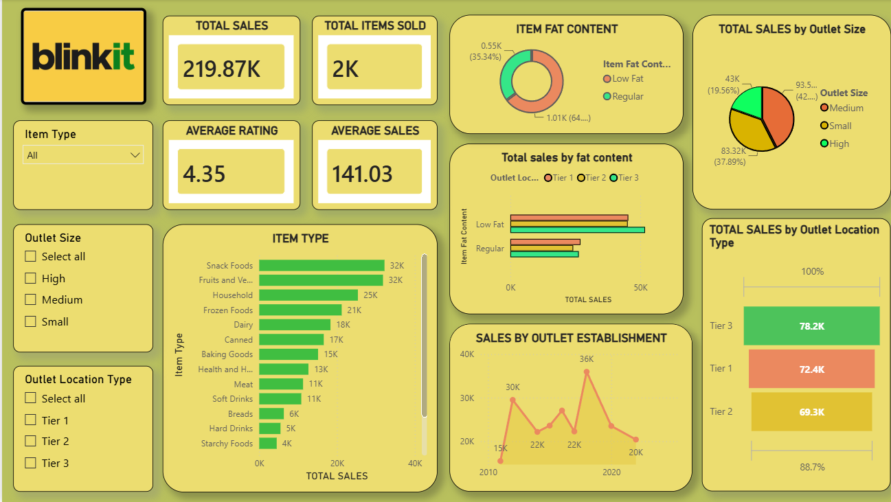

# BlinkIT Grocery Sales Dashboard

An interactive **Power BI dashboard** built to analyze BlinkIT grocery
sales data and provide a clear view of sales performance across item
types, outlet sizes, outlet locations, fat content, and establishment
years.

## Dashboard Preview



## Project Overview

This project uses Power BI to transform BlinkIT grocery sales data into
an interactive business intelligence dashboard.

The dashboard focuses on answering questions such as:

-   What is the total sales generated?
-   How many items were sold?
-   What is the average customer rating?
-   What is the average sales value?
-   Which item categories contribute the most to sales?
-   How do sales vary by outlet size?
-   Which outlet location tier generates the highest sales?
-   How does sales performance change based on item fat content?
-   How have sales changed across outlet establishment years?

## Key KPIs

The dashboard contains four main KPI cards created using **Power BI
measures / DAX**:

  KPI                  Value shown in dashboard
  ------------------ --------------------------
  Total Sales                           219.87K
  Total Items Sold                           2K
  Average Rating                           4.35
  Average Sales                          141.03

These KPI measures provide a quick summary of the overall business
performance.

## Dashboard Features

### 1. Item Type Analysis

A horizontal bar chart compares total sales across different item
categories.

Top-performing categories in the dashboard include:

-   Snack Foods
-   Fruits and Vegetables
-   Household
-   Frozen Foods
-   Dairy
-   Canned
-   Baking Goods
-   Health and Hygiene
-   Meat
-   Soft Drinks
-   Breads
-   Hard Drinks
-   Starchy Foods

### 2. Item Fat Content

A donut chart shows the distribution of sales between:

-   Low Fat
-   Regular

A separate bar chart compares sales by fat content across different
outlet location tiers.

### 3. Outlet Size Analysis

The outlet-size visualization compares sales across:

-   Medium
-   Small
-   High

This helps identify which outlet size contributes the most to overall
sales.

### 4. Outlet Location Analysis

Sales are compared across:

-   Tier 1
-   Tier 2
-   Tier 3

The dashboard shows **Tier 3 outlets** as the highest sales contributor
among the three location types.

### 5. Outlet Establishment Analysis

A line chart tracks sales performance based on the outlet establishment
year, making it easier to identify changes and trends over time.

### 6. Interactive Filters

The dashboard includes slicers for:

-   Item Type
-   Outlet Size
-   Outlet Location Type

These filters allow users to interactively explore different segments of
the dataset.

## Dataset

The project uses the `BlinkIT Grocery Data.xlsx` dataset included in
this repository.

The dataset contains **8,523 records** and the following fields:

  Column                      Description
  --------------------------- --------------------------------------------
  Item Fat Content            Fat-content classification of the item
  Item Identifier             Unique identifier for an item
  Item Type                   Grocery/product category
  Outlet Establishment Year   Year in which the outlet was established
  Outlet Identifier           Unique outlet identifier
  Outlet Location Type        Tier classification of the outlet location
  Outlet Size                 Size category of the outlet
  Outlet Type                 Type of outlet
  Item Visibility             Visibility percentage/value of the item
  Item Weight                 Weight of the item
  Sales                       Sales generated by the item
  Rating                      Customer rating

## Tools & Technologies

-   **Power BI Desktop** -- Dashboard development and visualization
-   **DAX** -- KPI and analytical measures

## Power BI Concepts Used

This project demonstrates practical use of:

-   Data import
-   Data modeling
-   DAX measures
-   KPI cards
-   Slicers
-   Bar charts
-   Donut charts
-   Line charts
-   Conditional visual analysis
-   Interactive filtering
-   Dashboard layout and formatting
-   Business-oriented data visualization

## DAX Measures

The dashboard uses Power BI measures for its KPI cards and analytical
calculations.

Typical measures used for this dashboard include calculations for:

-   Total Sales
-   Total Items Sold
-   Average Rating
-   Average Sales

The measures are used instead of hard-coded KPI values so that the
dashboard updates dynamically when users apply filters or slicers.

## Repository Structure

``` text
BlinkIT-PowerBI-Dashboard/
│
├── README.md
├── BlinkIT Dashboard.pbix
│
├── screenshots/
│   ├── dashboard.png
│   ├── filters.png
│   ├── kpis.png
│   ├── visual-1.png
│   └── visual-2.png
│
└── documentation/
    └── BlinkIT Power BI Project Report.pdf
```

> Rename the `.pbix` filename in the structure above if your Power BI
> file uses a different name.

## Dashboard Design

The dashboard uses a consistent visual theme inspired by the BlinkIT
brand:

-   Yellow/green background
-   Rounded visual containers
-   KPI cards for high-level metrics
-   Green/orange/yellow chart elements
-   Interactive slicers
-   Clean business-focused layout

The dashboard is designed to provide both **high-level KPIs** and
**detailed sales analysis** on a single report page.

## Key Insights

Based on the current dashboard view:

-   Total sales are approximately **219.87K**.
-   The average rating is **4.35**, indicating a strong overall customer
    rating.
-   Snack Foods and Fruits & Vegetables are among the highest-selling
    item categories.
-   Tier 3 outlets contribute the highest sales among the three outlet
    location tiers.
-   Medium-sized outlets contribute the largest share of sales among the
    outlet-size categories shown.
-   Regular-fat and Low-fat products can be compared directly using the
    fat-content visuals.
-   Sales performance varies across outlet establishment years, with
    visible peaks and declines over time.

## How to Use

1.  Download or clone this repository.
2.  Open the Power BI `.pbix` file using **Power BI Desktop**.
3.  If required, update the dataset path to the included Excel file.
4.  Use the slicers to filter the dashboard.
5.  Hover over charts to view detailed values.
6.  Select different categories to interact with the report.

## Project Purpose

This project was created as a **Power BI data analytics and dashboarding
project** to demonstrate the ability to:

-   Work with real-world-style sales data
-   Build analytical DAX measures
-   Create interactive dashboards
-   Identify business trends
-   Present data-driven insights in a visually understandable format
